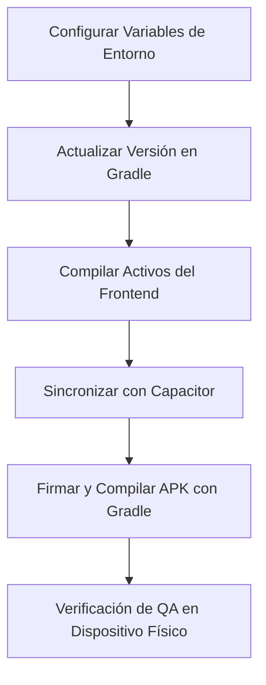

# Lista de Verificación para Generación de APK de Lanzamiento (Release APK Checklist)

Esta guía detalla el proceso paso a paso para compilar, firmar, configurar y validar un archivo APK de lanzamiento para la aplicación móvil **MicoPay**. Sigue este procedimiento para garantizar builds reproducibles en entornos de desarrollo (`dev`), redes de prueba (`testnet`) o producción (`prod`).

---

## 📋 Resumen del Flujo de Compilación


---

## 1. Configuración de Variables de Entorno y Destinos de API
El APK embebe las variables de entorno en tiempo de compilación. Selecciona el archivo `.env` adecuado en `micopay/frontend/` según el destino de tu build:

| Variante | Archivo Env | URL Backend (`VITE_API_URL`) | Propósito / Stellar Network |
| :--- | :--- | :--- | :--- |
| **development** | `.env.development` | `http://localhost:3002` (o IP local de tu LAN) | Pruebas locales con simulador o emulador |
| **testnet** | `.env.testnet` | `https://testnet-api.micopay.app` (o staging URL) | Pruebas con backend remoto y red Testnet de Stellar |
| **production** | `.env.production` | `https://api.micopay.app` | Lanzamiento oficial en red principal (Mainnet) |

> [!WARNING]
> Asegúrate de que `VITE_API_URL` esté presente y no esté vacío. Si compilas la aplicación con esta variable ausente, la app detectará la falta de configuración en el arranque y mostrará una pantalla roja de error de bloqueo, previniendo fallos silenciosos en producción.

---

## 2. Configuración de la Versión de la Aplicación
Antes de cada compilación para distribución o pruebas, incrementa las versiones en el archivo de configuración de Android:

1. Abre [android/app/build.gradle](file:///c:/Users/USER/Documents/Codes/Stellar/micopay_protocol/micopay/frontend/android/app/build.gradle).
2. Localiza la sección `defaultConfig`:
   ```groovy
   defaultConfig {
       applicationId "com.micopay.app"
       minSdkVersion rootProject.ext.minSdkVersion
       targetSdkVersion rootProject.ext.targetSdkVersion
       versionCode 1       // Incrementa este entero secuencialmente (ej. 1, 2, 3...)
       versionName "0.1.0" // Incrementa la versión semántica (ej. "0.1.0", "0.2.0"...)
       testInstrumentationRunner "androidx.test.runner.AndroidJUnitRunner"
       ...
   }
   ```
3. Guarda los cambios.

---

## 3. Configuración de Firma Digital (Signing Config)
Para poder instalar el APK en dispositivos físicos, este debe estar debidamente firmado. **NUNCA** subas tus contraseñas o archivos `.keystore` al repositorio Git.

### A. Generar un Keystore de Lanzamiento (Una sola vez)
Si no cuentas con un archivo keystore para firmar, ejecútalo en tu terminal:
```bash
keytool -genkey -v -keystore micopay-release.keystore -alias micopay -keyalg RSA -keysize 2048 -validity 10000
```
Guarda este archivo `micopay-release.keystore` en un directorio seguro (fuera del repositorio git) o dentro de `micopay/frontend/` asegurándote de que esté excluido en el `.gitignore`.

### B. Configurar Credenciales Locales de Firma
Crea un archivo llamado `keystore.properties` dentro de `micopay/frontend/android/` (este archivo está configurado en `.gitignore` para no ser rastreado):
```properties
storeFile=../../micopay-release.keystore
storePassword=CONTRASENA_DEL_ALMACEN
keyAlias=micopay
keyPassword=CONTRASENA_DE_LA_LLAVE
```

---

## 4. Compilación Paso a Paso del APK Candidate

Sigue estos comandos ordenados para generar el APK firmado:

### Paso A: Limpiar y Compilar el Frontend React
Ubícate en `micopay/frontend/` y ejecuta el script correspondiente a la variante elegida:
```bash
cd micopay/frontend

# Para variante Testnet (APK contra Backend remoto de pruebas):
npm run build:testnet

# Para variante de Producción:
npm run build:prod

# Para variante de Desarrollo local:
npm run build:dev
```
Esto generará los activos estáticos compilados en la carpeta `micopay/frontend/dist/` leyendo las variables correctas.

### Paso B: Sincronizar Activos con el Proyecto Android
Usa Capacitor CLI para copiar el bundle generado al entorno Android nativo:
```bash
npx cap sync android
```

### Paso C: Compilar el Binario con Gradle
Entra a la carpeta del proyecto Android y compila usando Gradle Wrapper:
```bash
cd android
./gradlew assembleRelease
```
El archivo APK firmado listo para distribución se generará en:
`micopay/frontend/android/app/build/outputs/apk/release/app-release.apk`

---

## 5. Lista de Pruebas de QA en Dispositivos Físicos (Sideload Validation)
Antes de aprobar el APK candidate como listo para release, instala el archivo `app-release.apk` en un dispositivo Android de prueba y valida la siguiente lista:

- [ ] **Pantalla de Arranque e Identidad**:
  - El APK arranca sin crashes instantáneos ni pantallas blancas eternas.
  - Si el backend está desconectado y estás en build `testnet` o `dev`, la app muestra el banner superior: `🎭 Servidor Desconectado (Ejecutando Demo Local)`.
  - Si estás en modo real (`mockStellar` es false en el backend) y faltan configuraciones críticas (como la llave plataforma o contratos), la app muestra la pantalla de bloqueo: `Configuración del Contrato Incompleta`.

- [ ] **Permisos en Runtime**:
  - Al abrir el mapa de depósitos/retiros, la aplicación solicita de manera transparente el permiso de geolocalización.
  - Al ir a cobrar o interactuar en el flujo de comercio (`inbox`), la app solicita permiso de cámara para el lector de códigos QR.
  - Si el usuario rechaza los permisos, la app no se cae (no realiza crash) y provee un mensaje explicativo al respecto.

- [ ] **Lector QR y Cámara**:
  - Escanea de manera efectiva códigos QR de transacciones de prueba usando la cámara nativa del teléfono.

- [ ] **Conexión de Red Nativa (CORS)**:
  - Inicia sesión y realiza una transacción de prueba.
  - Verifica en el panel de depuración que el origen `https://localhost` o similar sea aceptado por el backend sin bloqueos de seguridad de CORS.

- [ ] **Overlay de Depuración**:
  - Toca el botón flotante flotante (icono de bicho) en la esquina inferior derecha (o accede desde **Perfil -> Herramientas -> Depuración y Redes**).
  - Confirma que se muestren correctamente los Contract IDs, el endpoint de API conectado y el estado del Mock Stellar.
  - Presiona "Restablecer Usuarios Locales" para validar que se limpie la sesión e inicie el flujo de registro nuevo.
